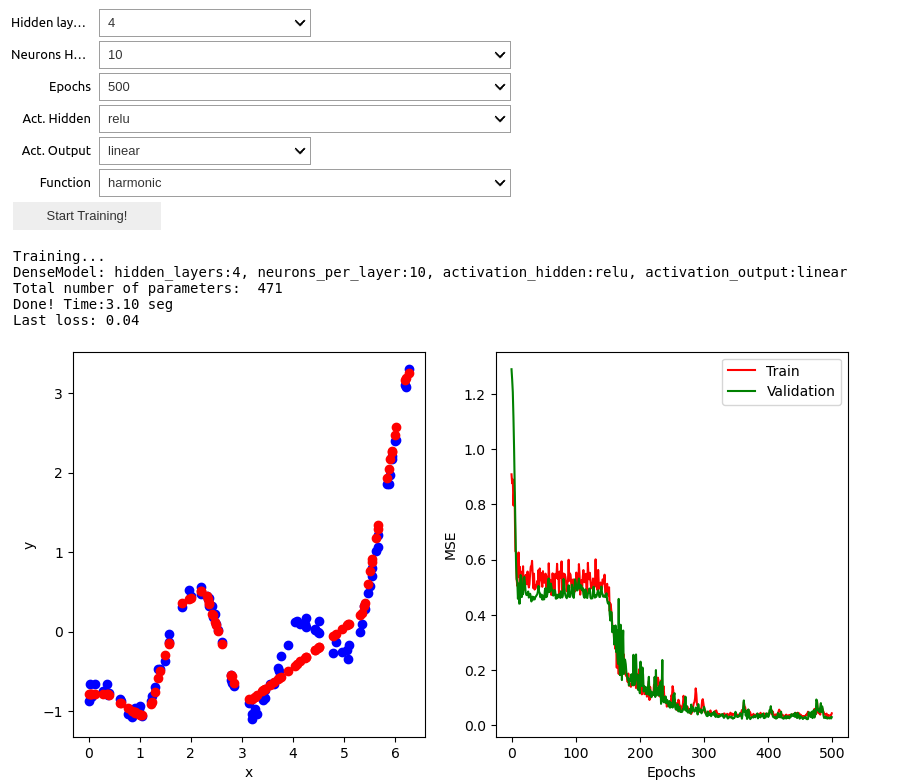

#  PyTorch NN Basics

The objective of this homework is to apply some of the tools we have learned so far (widgets, GitHub, PyTorch, and NN) 
to build a test bed to evaluate multiple NN parameters easily. 

## Test bed for Simple Neural Networks

We will make a test bed where we can create **dense** NNs with different parameters. 
The parameters we will be able to test in real time are:
1. Number of hidden layers.
2. Number of neurons for the hidden layers.
3. Activation function used in hidden layers (Sigmoid, Tanh, or ReLu)
4. Activation function used in the output layer (Sigmoid, Tanh, ReLu, Linear)
5. Number of epochs to train the model.

## Make a *dynamic* NN module (10) 
Inside **MyModels.py** create a class called **DenseModel** that
imports from **nn.Module** and receives the following parameters in the constructor:

* **hidden_layers**. Number of hidden layers (default value 1)
* **neurons_per_layer**. Number of neurons for hidden layers (default value 1)
* **activation_hidden**. Activation function to be used in the hidden layers. Options: 'relu', 'sigmoid', 'tanh','linear'. 
Default value of 'relu'.
* **activation_output**. Activation function to be used in the output layer. 
Options: 'relu', 'sigmoid', 'tanh', 'linear'. 

Depending on the input values, the constructor should create the appropriate number of layers, neurons, and activation functions. 

Finally, create a **forward** method that receives the input data and returns the output of the previously created NN model.

## Make a *dynamic* Training module (10) 
Inside **Training.py** create a function called **training** that
receives the following parameters:

* **x**. The input data to be used in the training.
* **y**. The output data to be used in the training. 
* **optimizer**. The optimizer to be used in the training. 
* **loss**. The loss function to be used in the training. (default value: `nn.MSELoss()`)
* **model**. The model to be trained. (default value: CustomDense())
* **epochs**. Number of epochs to train the model. (default value: 500)

The function should train the model for the specified number of epochs and return:
1. The loss function for each epoch as a list.
2. The trained model.

## Make your test bed (10)
Following the provided jupyter notebook called **TestBed.ipynb** fill the missing code of the widget
to make a test bed where you can:

1. A slider to select the number of hidden layers. Options from 1 to 5.
2. A slider to select the number of neurons for each hidden layer. Options from 1 to 100.
3. A slider to select the number of epochs to train the model. Options from 1 to 1000.
4. A dropdown menu to select the activation function for the hidden layers. Options are: 'relu', 'sigmoid', 'tanh', 'linear'. (default value: 'relu')
5. A dropdown menu to select the activation function for the output layer. Options are: 'relu', 'sigmoid', 'tanh', 'linear'. (default value: 'linear')
6. A button to start the training.

The widget should show the following plots: 
1. Figure 1. Observations to be approximated and the function approximated by the trained model.
2. Figure 2. The loss function for each epoch.

Example:
